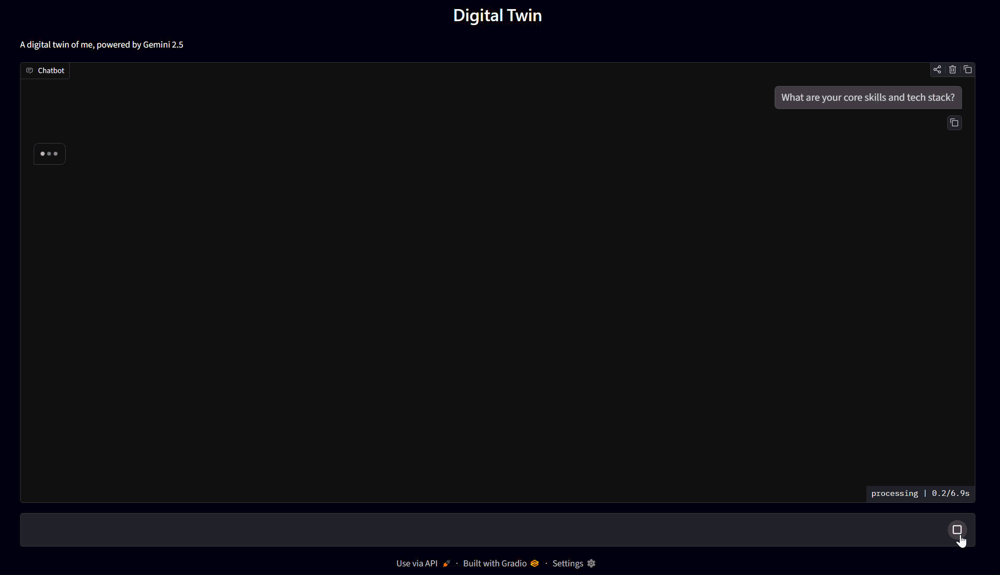
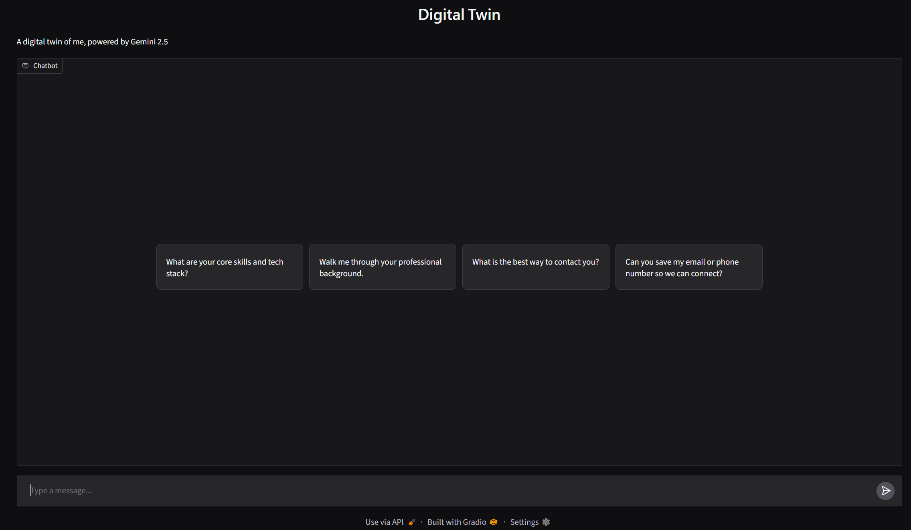
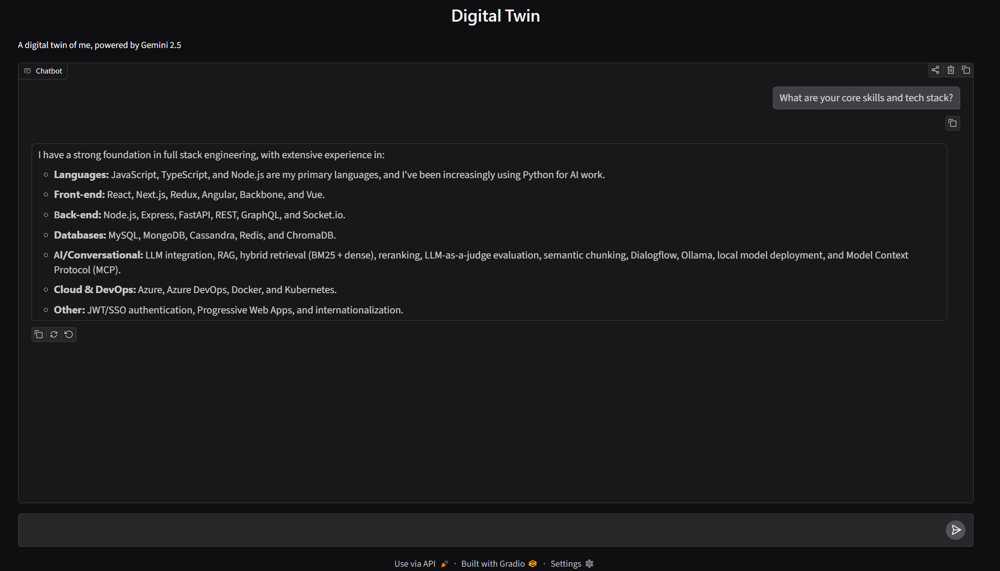

# 🤖 Digital Twin — AI Representative

[](https://www.python.org/downloads/)
[](https://github.com/googleapis/python-genai)
[](https://gradio.app/)
[](LICENSE)

An interactive, persona-grounded **Conversational AI Digital Twin** powered by **Google Gemini 2.5** and **Gradio**. 

This system represents a professional's background, technical skills, opinions, and experience. It answers visitor questions with strict adherence to a source profile, provides live streaming with reasoning/thinking summaries, and executes tool calls to capture visitor contact details.

<p align="center">
  
</p>

---

## 📸 Interface Preview

| Landing View & Quick Prompts | Live Conversation & Tech Stack |
| :---: | :---: |
|  |  |

---

## ✨ Features

- **Strict Source Grounding:** Operates strictly within the boundaries of a source profile (`src/data/me.txt`), avoiding hallucinations while answering in the first person as a digital representative.
- **Tool Calling & Lead Generation:** Autonomous function calling capabilities via Gemini:
  - `record_email`: Safely records visitor email addresses.
  - `record_phone_number`: Safely records visitor phone numbers.
- **Thinking Summaries & Live Streaming:** Built with the Google GenAI Interactions API to stream responses and surface reasoning/thought process in real time (`src/app.py`).
- **Interactive Web Interface:** Clean Gradio UI with pre-configured example questions for recruiters, collaborators, and visitors.
- **Dual Execution Modes:**
  - **Streaming & Multi-step Agent** (`src/app.py`): Full streaming interaction agent with dynamic tool dispatching and thinking state.
  - **Standard Chat Client** (`src/main.py`): Fast, direct chat interface using Gemini chat sessions.

---

## 📁 Project Structure

```text
digital_twin/
├── assets/
│   ├── demo.gif                    # Live recording of the UI & interaction
│   ├── landing_ui.png              # Gradio interface landing view
│   └── chat_preview.png            # Live conversation screenshot
├── src/
│   ├── app.py                      # Streaming agent with tool calling & thinking summaries
│   ├── main.py                     # Standard Gradio chat interface
│   ├── context.py                  # Prompt hydration & example prompt definitions
│   ├── prompt.py                   # System prompt, guardrails & grounding rules
│   ├── tools.py                    # Tool implementations (record email & phone)
│   ├── record_email.json           # Function schema for email recording
│   ├── record_phone_number.json    # Function schema for phone recording
│   └── data/
│       ├── .gitkeep                # Directory marker
│       ├── me.example.txt          # Template source profile (tracked in git)
│       ├── me.txt                  # (Ignored) Your actual personal profile
│       ├── email.txt               # (Ignored) Saved contact emails
│       └── phone.txt               # (Ignored) Saved contact phone numbers
├── .env.example                    # Environment variable template
├── .gitignore                      # Git ignore rules for logs, secrets, and environments
├── dev.bat                         # Windows quick-launch script (runs src/app.py)
├── pyproject.toml                  # Project metadata and dependencies (PEP 518/621)
├── requirements.txt                # Pip requirements lockfile
└── README.md                       # Project documentation
```

---

## 🚀 Getting Started

### 1. Prerequisites

- **Python 3.11+** installed on your system.
- A **Google Gemini API Key** (available for free at [Google AI Studio](https://aistudio.google.com/)).
- Recommended package manager: [`uv`](https://docs.astral.sh/uv/) (or standard `pip`).

### 2. Installation

Clone this repository to your local machine:

```bash
git clone https://github.com/your-username/digital-twin.git
cd digital-twin
```

#### Using `uv` (Fastest):
```bash
uv sync
```

#### Using standard `pip` / `venv`:
```bash
python -m venv .venv
# On Windows:
.venv\Scripts\activate
# On Linux/macOS:
source .venv/bin/activate

pip install -r requirements.txt
```

### 3. Environment Configuration

Copy the example environment file and insert your Gemini API Key:

```bash
cp .env.example .env
```

Edit `.env`:
```env
GEMINI_API_KEY="your_actual_gemini_api_key_here"
```

---

## 💻 Running the Application

### Option A: Advanced Agent with Streaming & Tools (Recommended)
Runs the streaming chat interface with thinking summaries and tool execution:
```bash
uv run python src/app.py
# or with active virtualenv:
python src/app.py
```

### Option B: Standard Chat Interface
Runs the lightweight chat interface:
```bash
uv run python src/main.py
# or with active virtualenv:
python src/main.py
```

### Windows Shortcut:
Double-click or run [`dev.bat`](file:///d:/Studies/Workspace/AI/digital_twin/dev.bat) to launch the app directly.

Once started, the Gradio web UI will launch in your default web browser (default: `http://127.0.0.1:7860`).

---

## 🛠️ Customizing Your Own Digital Twin

To adapt this project for your own persona:

1. **Create Your Profile:**
   Copy the example profile template:
   ```bash
   cp src/data/me.example.txt src/data/me.txt
   ```
   Edit [`src/data/me.txt`](file:///d:/Studies/Workspace/AI/digital_twin/src/data/me.txt) with your personal background, skills, career highlights, projects, and contact info (your `me.txt` is automatically git-ignored to keep your private details safe).
2. **Adjust Grounding & Tone:**
   Review [`src/prompt.py`](file:///d:/Studies/Workspace/AI/digital_twin/src/prompt.py) if you want to tweak tone, guidelines, or identity constraints.
3. **Customize Quick Prompts:**
   Update the `EXAMPLES` list in [`src/context.py`](file:///d:/Studies/Workspace/AI/digital_twin/src/context.py) to showcase the questions most relevant to you.

---

## 🔒 Security & Privacy

- Sensitive runtime secrets (`.env`), private profiles (`src/data/me.txt`), and lead capture files (`src/data/email.txt`, `src/data/phone.txt`) are excluded from version control via `.gitignore`.
- Only sanitized templates (`.env.example` and `src/data/me.example.txt`) are tracked in the repository.

---

## 📄 License

This project is licensed under the MIT License — see the [LICENSE](LICENSE) file for details.
